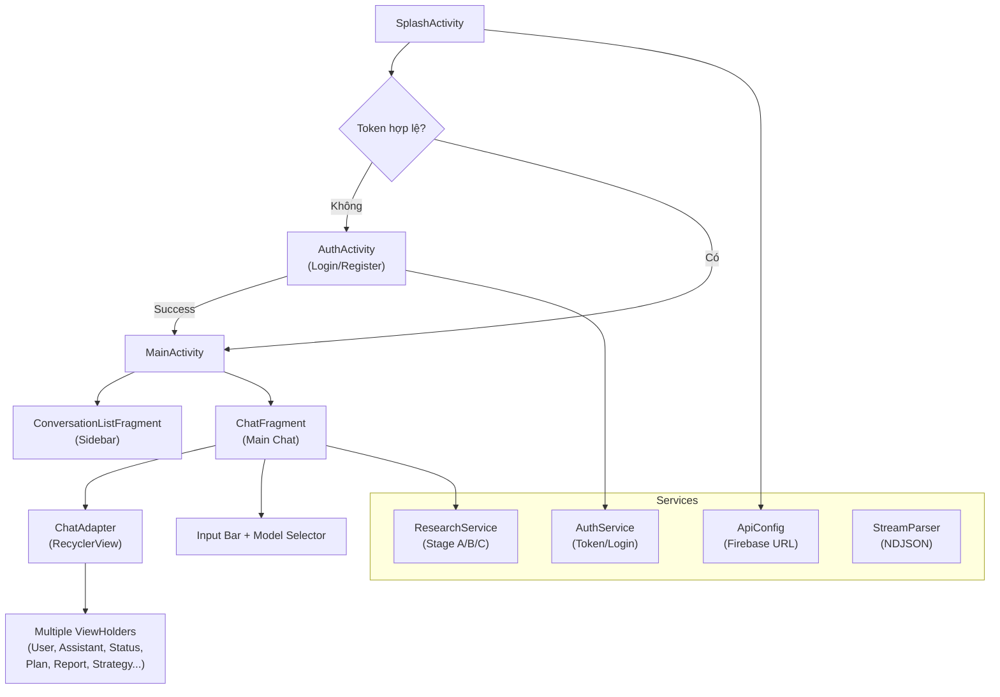

# MarketMind AI Android App — Full Implementation Plan

Xây dựng ứng dụng Android native (Java) với đầy đủ chức năng tương đương frontend React, bao gồm: xác thực người dùng, chat AI, nghiên cứu thị trường (Stage A), chiến lược marketing (Stage B), thực thi chiến dịch (Stage C), quản lý hội thoại, và lấy API URL từ Firebase.

## User Review Required

> [!IMPORTANT]
> Dự án Android hiện tại chỉ là template mặc định (Hello World) với 2 fragment trống. Toàn bộ source code sẽ được **viết lại hoàn toàn** — chỉ giữ lại cấu hình Gradle/manifest làm nền tảng.

> [!WARNING]
> Đây là một thay đổi **rất lớn** (~40+ files Java, ~20+ layouts XML, ~15+ drawable/resource files). Ước tính khoảng **3000-4000 dòng code Java** và **1500+ dòng XML**. Bạn cần review kế hoạch cẩn thận trước khi tiến hành.

## Open Questions

> [!IMPORTANT]
> 1. **Google Sign-In**: Frontend dùng Google OAuth. Android cần Google Sign-In SDK + SHA-1 key để hoạt động. Bạn đã có Google Cloud project + đã thêm SHA-1 cho Android chưa? Nếu chưa, tôi sẽ implement login/register bằng username/password trước, Google Sign-In sẽ có giao diện nhưng cần config thêm sau. Trả lời: Tôi đã tạo Firebase project, add Android app, thêm SHA-1 và bật Google Sign-In. Bạn implement full Google Sign-In và username/pass cho Android nhé.
> 2. **minSdk**: Hiện tại là 24 (Android 7.0). Có muốn giữ nguyên không? trả lời: có
> 3. **Ngôn ngữ**: Hiện tại project dùng Java. Bạn có muốn chuyển sang Kotlin không? Tôi sẽ triển khai bằng Java theo cấu hình hiện tại. Trả lời: sử dụng java

---

## Kiến Trúc Tổng Quan



---

## Proposed Changes

### 1. Gradle Dependencies

#### [MODIFY] [build.gradle.kts](file:///c:/Users/vien1/Downloads/OceanTech/School/DoAnTotNghiep/MarketMind-AI/android/app/build.gradle.kts)

Thêm các dependency cần thiết:
- **OkHttp 4.x** — HTTP client + streaming support (NDJSON)
- **Gson** — JSON parsing
- **Glide** — Image loading (cho campaign results)
- **SwipeRefreshLayout** — Pull-to-refresh cho conversation list
- **Google Sign-In** — Google OAuth (optional)
- **Markwon** — Markdown rendering trong report

---

### 2. Config & Firebase URL

#### [NEW] `ApiConfig.java`
- Hardcoded default ngrok URL (giống frontend)
- `FIREBASE_API_URL` để fetch dynamic backend URL
- `initializeBackendUrl()` — fetch URL từ Firebase on startup
- `getApiUrl(endpoint)` — build full URL
- `waitForInitialization()` — block until URL ready

#### [NEW] `SplashActivity.java`
- Màn hình splash với logo MarketMind AI
- Gọi `ApiConfig.initializeBackendUrl()` 
- Check token → redirect đến AuthActivity hoặc MainActivity

---

### 3. Authentication

#### [NEW] `AuthActivity.java` + `activity_auth.xml`
- Giao diện Login/Register giống frontend AuthPage
- Toggle giữa Login và Register mode
- Form: username, password, confirm password (register), name (register)
- Google Sign-In button
- Gọi `AuthService` để authenticate
- Redirect đến MainActivity on success

#### [NEW] `AuthService.java`
- `login(username, password)` → POST `/api/auth/login`
- `register(username, password, name)` → POST `/api/auth/register`
- `loginWithGoogle(googleToken)` → POST `/api/auth/google-login`
- `verifyToken()` → POST `/api/auth/verify-token`
- Token management với SharedPreferences (thay vì localStorage)
- `getAuthHeader()` → "Bearer {token}"
- `isAuthenticated()`, `logout()`

---

### 4. Main Activity (Chat Interface)

#### [MODIFY] [MainActivity.java](file:///c:/Users/vien1/Downloads/OceanTech/School/DoAnTotNghiep/MarketMind-AI/android/app/src/main/java/com/example/marketmindai/MainActivity.java)

Viết lại hoàn toàn:
- **DrawerLayout** — Sidebar conversations (thay vì Navigation Component)
- **Toolbar** — Header với menu button, title, theme toggle, new chat, user info, logout
- **RecyclerView** — Chat messages
- **Input bar** — EditText + Send button + Model selector
- **Welcome Hero** — Hiển thị khi chưa có tin nhắn (CardView grid)
- **Suggestion Chips** — 4 gợi ý giống frontend

#### [MODIFY] [activity_main.xml](file:///c:/Users/vien1/Downloads/OceanTech/School/DoAnTotNghiep/MarketMind-AI/android/app/src/main/res/layout/activity_main.xml)

Layout mới:
```
DrawerLayout
├── Main Content (LinearLayout vertical)
│   ├── Toolbar
│   ├── RecyclerView (chat messages) — weight=1
│   └── Input Bar (LinearLayout horizontal)
│       ├── EditText
│       ├── Send Button
│       └── Model Selector (Spinner)
└── Drawer (NavigationView / FrameLayout)
    └── Conversation List (RecyclerView)
```

---

### 5. Chat System (RecyclerView Multi-Type)

#### [NEW] `ChatMessage.java` (Data Model)
- Tương đương `ChatMessage` TypeScript interface
- Fields: `id`, `type`, `content`, `timestamp`
- Typed payloads: `clarificationData`, `planData`, `reportData`, `strategyData`, etc.

#### [NEW] `ChatAdapter.java` (RecyclerView.Adapter)
- **Multi-type ViewHolder pattern** giống `ChatMessageBubble` switch/case
- ViewHolder types:
  - `UserMessageVH` — Bubble user (right-aligned)
  - `AssistantMessageVH` — Bubble assistant (left-aligned)
  - `StatusMessageVH` — Status dot + text
  - `ErrorMessageVH` — Error with icon
  - `ClarificationVH` — Form with editable fields
  - `PlanVH` — Expandable card (research plan)
  - `ReactSummaryVH` — Stats grid + steps
  - `EvidenceVH` — Expandable evidence list
  - `ReportVH` — Expandable report sections with markdown
  - `KnowledgeVH` — Knowledge answer + sources
  - `MarketingFormVH` — 5-field form (product, target, value, pricing)
  - `ProposalVH` — Stage B/C proposals with Accept/Decline
  - `StrategyVH` — SWOT, USP, Persona, Pillars, Briefs
  - `CampaignResultsVH` — Campaign execution results
  - `CompletedVH` — Completion badge
  - `ScheduleProposalVH` — Schedule editor

#### [NEW] Layout files cho mỗi ViewHolder type:
- `item_chat_user.xml`
- `item_chat_assistant.xml`
- `item_chat_status.xml`
- `item_chat_error.xml`
- `item_chat_clarification.xml`
- `item_chat_plan.xml`
- `item_chat_react_summary.xml`
- `item_chat_evidence.xml`
- `item_chat_report.xml`
- `item_chat_knowledge.xml`
- `item_chat_marketing_form.xml`
- `item_chat_proposal.xml`
- `item_chat_strategy.xml`
- `item_chat_campaign_results.xml`
- `item_chat_completed.xml`
- `item_chat_schedule_proposal.xml`
- `item_chat_welcome.xml`

---

### 6. API Services

#### [NEW] `ResearchService.java`
- Mirror của `researchService.ts`
- Sử dụng OkHttp cho HTTP requests
- **NDJSON streaming** — đọc response body line-by-line
- Methods:
  - `callStageAResearch(request, callback)` — streaming
  - `callMarketingResearch(request, callback)` — streaming
  - `callStageBStrategy(request, callback)` — streaming
  - `callStageCCampaign(request, callback)` — streaming
  - `callStageCCampaignScheduled(request, callback)` — streaming
  - `approveStageBBriefs(request)` — simple POST
  - `listConversations()`, `getConversation()`, `createConversation()`
  - `saveMessagesToConversation()`, `deleteConversation()`

#### [NEW] `StreamCallback.java` (Interface)
```java
public interface StreamCallback {
    void onMessage(StreamMessage msg);
    void onError(String error);
    void onComplete();
}
```

#### [NEW] `StreamMessage.java` (Data Model)
- Tương đương `StreamMessage` TypeScript interface
- Parsed từ NDJSON lines bằng Gson

---

### 7. Conversation Management

#### [NEW] `ConversationListAdapter.java`
- RecyclerView adapter cho sidebar conversation list
- Mỗi item: title, last message preview, timestamp
- Swipe-to-delete hoặc long-press menu
- "New Conversation" button ở top

#### [NEW] `layout/item_conversation.xml`

---

### 8. Model Selector

#### [NEW] `ModelSelectorDialog.java` hoặc Spinner
- 3 options: Llama, Gemini 2.5, Gemini 3.1
- Giống `ModelSelector` component frontend

---

### 9. Resources & Theme

#### [MODIFY] `values/themes.xml`
- Material 3 dark theme (match frontend dark theme)
- Custom colors: accent-plan, accent-react, accent-evidence, accent-report

#### [MODIFY] `values/colors.xml`
- Brand colors từ frontend CSS
- `bg_primary: #0f1117`
- `bg_surface: #1a1b23`
- `accent_primary: #6366f1` (indigo)
- `accent_secondary: #8b5cf6`

#### [NEW] `values/strings.xml` (update)
- Tất cả strings tiếng Việt giống frontend
- Welcome message, suggestion chips, labels

#### [NEW] Drawables:
- `bg_chat_bubble_user.xml` — Rounded corner bubble
- `bg_chat_bubble_assistant.xml`
- `bg_chat_bubble_error.xml`
- `bg_input_bar.xml`
- `bg_send_button.xml`
- `bg_suggestion_chip.xml`
- `ic_send.xml` — Vector drawable

---

### 10. File Structure

```
com.example.marketmindai/
├── SplashActivity.java
├── AuthActivity.java
├── MainActivity.java
├── config/
│   └── ApiConfig.java
├── service/
│   ├── AuthService.java
│   └── ResearchService.java
├── model/
│   ├── ChatMessage.java
│   ├── StreamMessage.java
│   ├── User.java
│   ├── Conversation.java
│   ├── ResearchReport.java
│   ├── StageBOutput.java
│   ├── ContentBrief.java
│   ├── CampaignLog.java
│   └── ... (other data models)
├── adapter/
│   ├── ChatAdapter.java
│   └── ConversationListAdapter.java
└── util/
    └── StreamParser.java
```

---

## Verification Plan

### Automated Tests
- Build project: `./gradlew assembleDebug` — ensure no compilation errors
- Lint check: `./gradlew lint`

### Manual Verification
- Install trên emulator/thiết bị thật
- Test flow: Splash → Auth → Chat → Send message → Receive streaming response
- Test conversation sidebar
- Test model selector
- Test login/logout

---

## Implementation Order

1. **Phase 1**: Gradle deps + ApiConfig + SplashActivity
2. **Phase 2**: AuthService + AuthActivity  
3. **Phase 3**: MainActivity layout + ChatMessage model + ChatAdapter (basic types)
4. **Phase 4**: ResearchService (streaming) + integrate Stage A
5. **Phase 5**: Advanced ViewHolders (Report, Strategy, Marketing Form, etc.)
6. **Phase 6**: Conversation management (sidebar)
7. **Phase 7**: Stage B/C integration
8. **Phase 8**: Theme polish + resources
